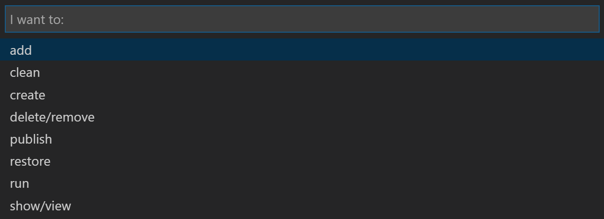
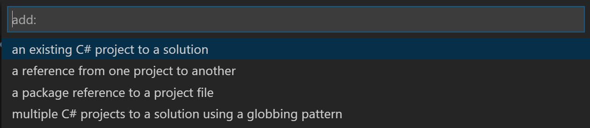
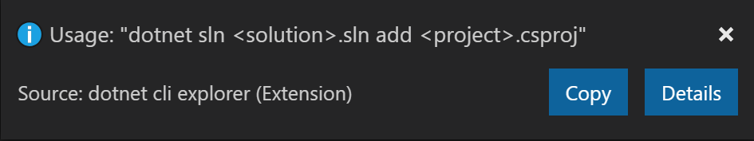
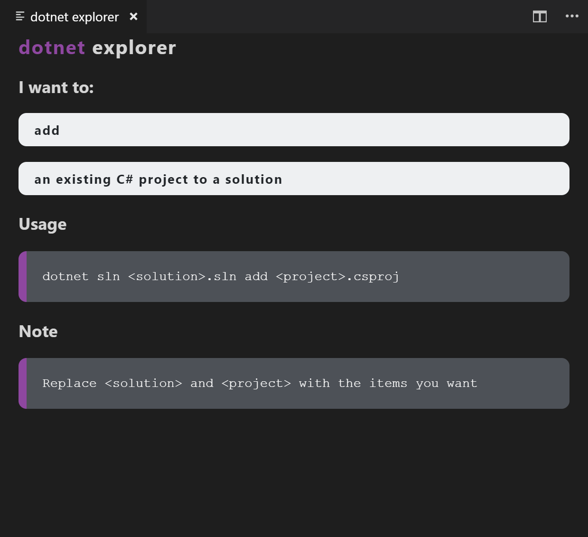

# dotnet CLI Explorer Extension for Visual Studio Code

A [Visual Studio Code](https://code.visualstudio.com/) extension that provides support for .NET CLI (Command Line Interface) in Visual Studio Code.

## Features

* Finc Commands through a multistep quickpick workflow.

* Once an option is chosen, an information message displays the right command.. The use can copy the command to the clipboard for further usage.

* The user can ask for details and a webview with usage and note  is displayed.

## Requirements

As the extension is standalone helper, no dependency is required before using it in VS Code.

* [Install Visual Studio Code](https://code.visualstudio.com/)

## Quickstart

### Setup

1. Open the VS Code application.
2. Click on the extension icon in the explorer. Search for dotnet explorer. Click install for the dotnet eplorer extension.

### Commands

The dotnet explorer extension for VS Code helps developers to find the right dotnet cli commands using a simple multi-step dropdown input. Commands can be called pressing (Ctrl + Shift + p), typing the command name into the input bar, and selecting the desired command for the prompt list.

* **dotnet explorer : Find a command** (the command start the multi-step search workflow)

## Changelog

See [CHANGELOG.md](CHANGELOG.md)